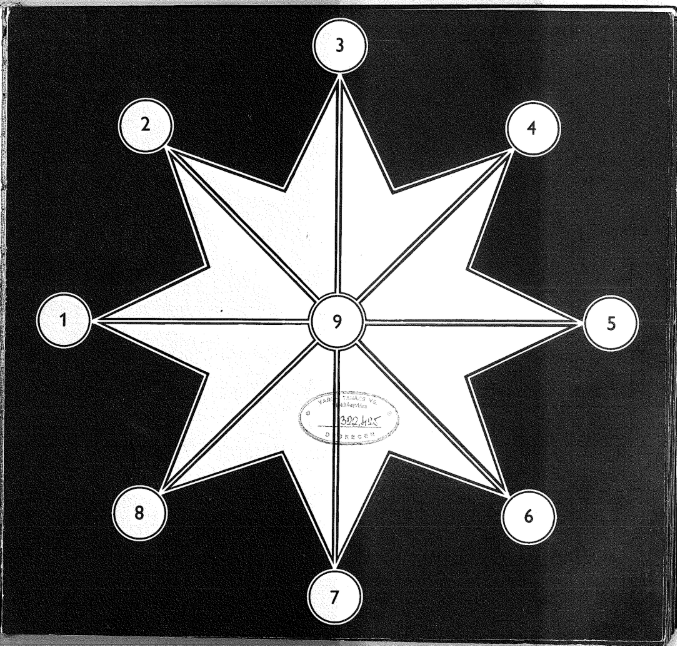

# Csillagjáték (Mu Torere)

Egy kétszemélyes stratégiai társasjáték Java nyelven megvalósítva, ahol az ember a géppel játszik. A játék alapja a **Mu Torere**, egy ősi maori táblajáték, amelyet csillag alakú táblán játszanak.



---

## A játékról

A Mu Torere egy kétszemélyes stratégiai játék, amelyet egy nyolcágú csillag alakú táblán játszanak. A tábla 9 mezőből áll: egy középső mezőből (*putahi*) és nyolc külső mezőből (*kewai*), amelyek körkörösen kapcsolódnak egymáshoz.

### Játékszabályok

- Minden játékosnak **4 bábuoja** van. Az ember bábujai az **X**, a gépé az **O** jellel vannak jelölve.
- A kezdő elrendezés: az ember bábujai az 1–4, a gép bábujai az 5–8 külső mezőkön állnak, a középső mező üres.
- **Lépési lehetőségek:**
  - Egy bábu léphet a szomszédos **üres külső mezőre** (körkörösen).
  - A **középső mezőre** csak akkor lehet lépni, ha a bábunak legalább egy közvetlen szomszédja az ellenfél bábuoja.
  - A **középső mezőn** álló bábu bármely üres külső mezőre léphet.
- **A játék célja:** az ellenfelet olyan helyzetbe hozni, ahol **egyáltalán nem tud szabályos lépést tenni**. Aki nem tud lépni, az veszít.

---

## Funkciók

- Grafikus felhasználói felület (Java Swing)
- Gépi ellenfél Minimax algoritmussal és Alfa-Béta vágással (8 mélység)
- Játékállás mentése és betöltése SQLite adatbázisból (játékosnévhez kötve)
- Félbehagyott játék folytatása ugyanazzal a névvel
- Magyar nyelvű felület és forráskód

---

## Projekt struktúra

```
src/
├── main/
│   └── java/
│       ├── Main.java              # Belépési pont, GUI indítása
│       ├── JatekGUI.java          # Grafikus felhasználói felület (Swing)
│       ├── Tabla.java             # Táblát és játéklogikát kezelő osztály
│       ├── MinimaxMI.java         # Minimax + Alfa-Béta vágás algoritmus
│       └── AdatbazisKezelo.java   # SQLite alapú játékállás mentés/betöltés
└── test/
    └── java/
        └── ...                    # JUnit 5 unit tesztek
pom.xml                            # Maven build konfiguráció
csillagjatek.db                    # SQLite adatbázis (automatikusan jön létre)
```

---

## Technológiák

| Technológia | Verzió | Szerepe |
|---|---|---|
| Java | 11+ | Fejlesztési nyelv |
| Maven | 3.x | Build és dependency kezelés |
| Java Swing | JDK beépített | Grafikus felület |
| SQLite JDBC | 3.45.1.0 | Játékállás perzisztencia |
| JUnit Jupiter | 5.10.2 | Unit tesztelés |
| AssertJ | 3.25.3 | Tesztállítások |
| JaCoCo | 0.8.11 | Kódlefedettség mérés (min. 95%) |

---

## Telepítés és futtatás

### Előfeltételek

- Java 11 vagy újabb
- Apache Maven 3.x

### Buildelés

```bash
mvn clean compile
```

### Futtatás

```bash
mvn exec:java
```

### Tesztek futtatása

```bash
mvn test
```

### Kódlefedettség riport

```bash
mvn verify
```

A riport a `target/site/jacoco/index.html` fájlban tekinthető meg.

---

## A mesterséges intelligencia

A gépi ellenfél **Minimax algoritmust** alkalmaz **Alfa-Béta vágással**, 8 lépés mélységig előretekintve.

### Heurisztika

A kiértékelő függvény a következőket veszi figyelembe:
- Az aktuális táblaállásban a gépnek és az embernek elérhető szabályos lépések száma
- Egyenlő értékű lépések esetén véletlenszerű választás (változatosabb játékmenet)

### Megjegyzés a nehézségről

A Mu Torere egy kis játéktérrel rendelkező játék (9 mező, 8 bábu). 8 mélységű Minimax mellett a gép gyakorlatilag az összes releváns jövőbeli állást előre látja, ezért nehéz ellene nyerni. Ez a játék természetéből fakad, nem programozási hiba.

---

## Adatbázis

A játékállások egy helyi `csillagjatek.db` SQLite fájlban tárolódnak, automatikusan az alkalmazás könyvtárában jönnek létre.

| Oszlop | Típus | Leírás |
|---|---|---|
| `player_name` | TEXT (PK) | Játékos neve |
| `board_state` | TEXT | Tábla állapota sztring formátumban |
| `current_player` | INTEGER | Aktuális játékos (1=ember, 2=gép) |
| `is_finished` | BOOLEAN | A játék befejeződött-e |

Ha egy játékos ugyanazzal a névvel indít új játékot, és az előző játék még nem fejeződött be szabályosan, a félbehagyott állás automatikusan visszatöltődik.

---

## Szerző

**Kátai Attila** – Mesterséges Intelligencia kurzus – JGXODS
